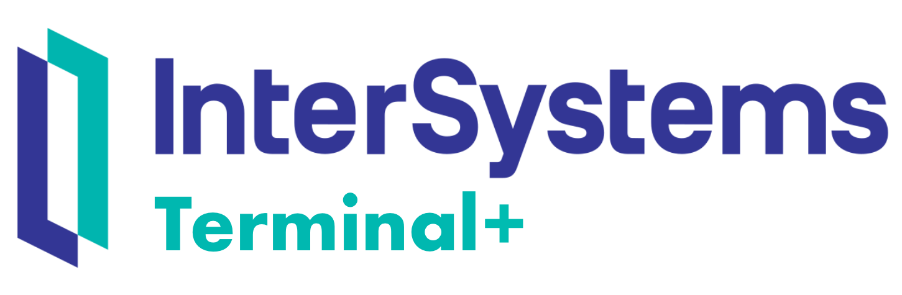

   
  
  <h1>InterSystems-Terminal-Plus</h1>
  

     A modern web terminal for <a href="https://www.intersystems.com/">InterSystems</a> IRIS and Caché.
  

<!-- Badges -->

   
   
   

---

## Installation

1. Download the latest release from the [releases page](https://github.com/intersystems-dach/InterSystems-Terminal-Plus/releases/latest).
2. Unzip the file.
3. In the InterSystems Management Portal, navigate to `System Explorer` > `Classes`.
4. Click `Import` and select _Directory_.
5. Select the `cls` folder from the unzipped folder.
6. Click `Import`.
7. Open an InterSystems Terminal and run `do ##class(TerminalPlus.Utils.Installer).SetUp()`.
8. Copy the API key displayed in the terminal.
9. Run `npm start` in the root folder of the directory (The website should open in your browser. When not open [localhost:4200](http://localhost:4200))
10. Paste the API key into the `API Key` field.
11. Type the hostaddress of your IRIS instance into the `Host` field.
12. Type the port of your IRIS instance into the `Port` field.
13. Click `Connect`.
14. Choose a namespace from the dropdown menu.

---

by [Philipp B.](https://github.com/cophilot)
